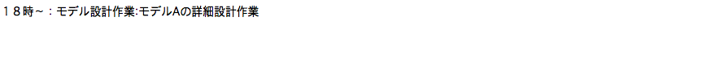

# Django_memo_app

## Overview
djangoの基本的な機能を活用してメモ帳を作るチュートリアルです。
 - CRUD（メモの一覧・追加・更新・削除機能）
 
## Requirements
 - Python (3.6.4)
 - Django (2.2.2)

## UI
### リスト | http://localhost:8000/memos

### 作成 | http://localhost:8000/memo/create, http://localhost:8000/modify/:id

### 詳細 | http://localhost:8000/show/:id

